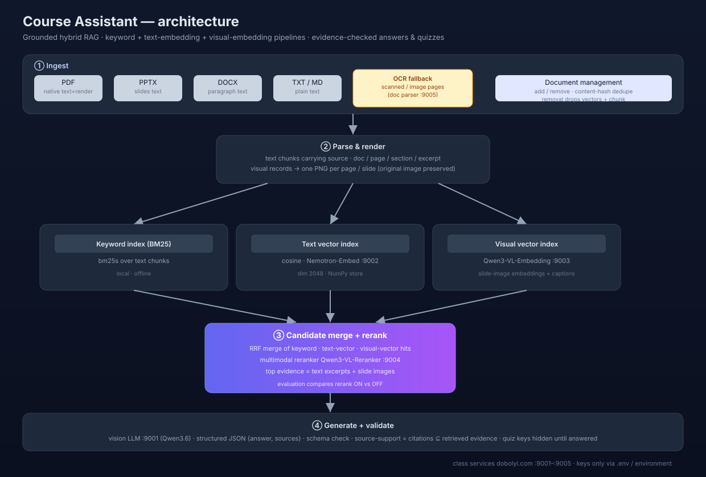
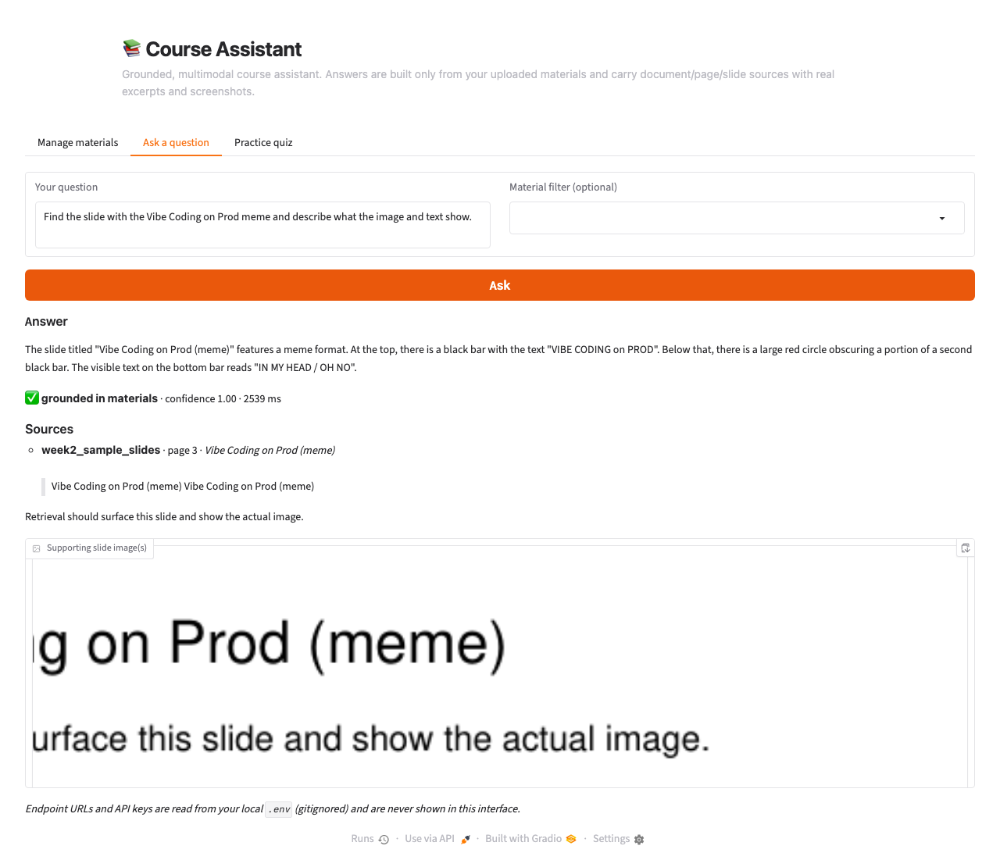
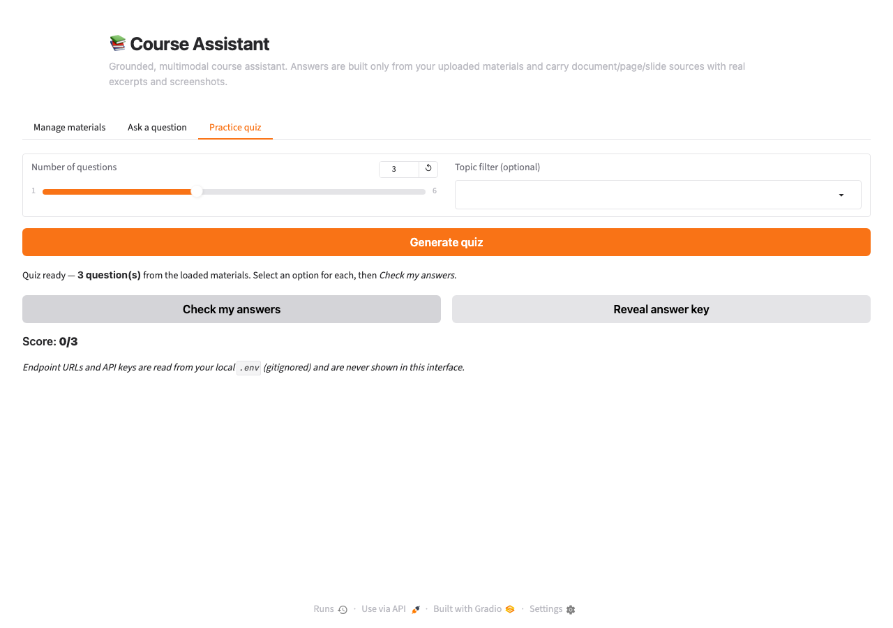

# Course Assistant

A grounded, multimodal course assistant that answers questions and generates
practice quizzes from course materials (slides, syllabus, PDFs, DOCX, PPTX…).
Uploaded documents are parsed into **text chunks** (with source provenance) and
**page/slide images**; hybrid retrieval — keyword (BM25), text embeddings, and
visual embeddings — retrieves evidence and a **multimodal reranker** orders it;
answers and quiz feedback cite the actual document/page/slide **with a real
excerpt and, where relevant, a screenshot of the slide**. Answers that the
materials do not support are called out instead of invented.

*Branch: `team/oliver-wip`. This is one design implementation for the team to
compare against others before the group selects a foundation.*

---

## Architecture



| Stage | What happens |
|------|--------------|
| **① Ingest** | Add / remove documents in the app. Content-hash dedupe (uploading the same file twice is a no-op). Removing a document drops its chunks, vectors, and page images from every index. |
| **② Parse & render** | PDF: text + one PNG per page (PyMuPDF). PPTX/DOCX: text extracted natively; slide images via an optional LibreOffice/manual PDF export. TXT/MD/image handled directly. Scanned/image pages fall back to the class OCR service. |
| **③ Three indexes** | BM25 keyword index (offline) + **text-vector** index (Nemotron :9002) + **visual-vector** index (Qwen3-VL :9003), kept separate. |
| **④ Merge + rerank** | Reciprocal Rank Fusion (RRF) merges the three retrievers; the **Qwen3-VL-Reranker (:9004)** re-orders candidates (multimodal: text excerpts *and* slide images). |
| **⑤ Generate + validate** | The **vision LLM (:9001)** writes a structured JSON `{answer, sources}` ground to the retrieved evidence only. Responses are schema-validated and citations are checked against the retrieved set. Quiz keys are fixed and hidden until the student answers. |

## Class services (config / secrets)

All reasoning runs on the class services at `dobolyi.com`. Ports and models
were **verified against each service's live `/v1/models`** (not guessed):

| Port | Role | Model |
|------|------|-------|
| 9001 | Vision-capable LLM | `cyankiwi/Qwen3.6-35B-A3B-AWQ-4bit` |
| 9002 | Text embeddings | `nvidia/Nemotron-3-Embed-1B-BF16` |
| 9003 | Visual embeddings | `Qwen/Qwen3-VL-Embedding-2B` |
| 9004 | Multimodal reranker | `Qwen/Qwen3-VL-Reranker-2B` |
| 9005 | Document parser / OCR | `dots.mocr` |

**Keys are never in the repository.** Endpoints and the `CLASS_SERVICE_API_KEY`
are read from environment variables or a local `.env` file (gitignored). See
[`.env.example`](.env.example) for the full shape with dummy values.

```bash
cp .env.example .env   # then fill in CLASS_SERVICE_API_KEY (and any overrides)
```

## Setup

Requires Python 3.11 and (recommended) `uv`.

```bash
uv venv --python 3.11 .venv
source .venv/bin/activate
uv pip install -r requirements.txt   # or: pip install -r requirements.txt
cp .env.example .env                 # fill in the class API key
```

Optional extra software for PPTX/DOCX **slide images**:
[LibreOffice](https://www.libreoffice.org) (`soffice` on PATH). If it is not
installed, PPTX/DOCX are still fully searchable by text; to show slide images
for them, export the deck to PDF first and upload the PDF instead.

## Run the app

```bash
python -m course_assistant.app        # opens http://127.0.0.1:7580
```

**Manage materials tab** — upload one or more files (PDF, PPTX, DOCX, TXT, MD,
PNG/JPG). Re-uploading the same file is detected and skipped. Select a document
and click *Remove* to delete it and all of its indexed content.

**Ask a question tab** — type a question (optionally filtered to one material).
The answer is grounded in the retrieved evidence, and supporting slide images
are displayed beside it with the document name and page number.

**Practice quiz tab** — pick how many questions (up to 6) and an optional topic,
then *Generate*. Answers are scored against the **stored, fixed** answer key;
the key and explanations stay hidden until you check an answer (or explicitly
*Reveal answer key*).

Generate synthetic sample materials (no course files): `python -m course_assistant.materials`.

## Supported file formats

| Format | Text | Page/slide images | Notes |
|--------|:----:|:-----------------:|-------|
| PDF | ✅ native | ✅ native render | empty-text pages OCR'd via :9005 |
| PPTX | ✅ python-pptx | ⚠️ via LibreOffice or manual PDF export | |
| DOCX | ✅ python-docx | ⚠️ via LibreOffice or manual PDF export | |
| TXT / MD | ✅ | — | |
| PNG / JPG | (OCR) | ✅ | single image page |

Unsupported types raise a clear error describing the accepted formats.

## Tests

```bash
python -m pytest tests/ -q
```

* **Offline unit tests** (run in CI, no network): chunking, parsing
  (generated fixtures), vector store / BM25 index, RRF merge, and document
  add/remove/dedupe + persistence.
* **Live end-to-end test** (`tests/test_e2e.py`): builds a small PDF with text
  and an image, and checks grounded Q&A, visual retrieval with a slide image,
  quiz generation with a fixed hidden key, unanswerable-question handling, and
  removal. It **skips automatically** when the class services are unreachable or
  no API key is set, so CI stays green without credentials.

> **Known bug fixed during testing:** the reranker is Cohere-flavored (`query`
> and `documents` are plain strings, or multimodal `{"content":[…]}`) — an
> initial client wrongly sent `{"text":…}`, which the service rejected. This
> was caught by the e2e/retrieval diagnostics after the grader stopped hiding
> service errors.

## Evaluation (compare rerank ON vs OFF)

Per the assignment, a fixed question set (5 text, 2 visual, 1 unanswerable) was
run over the **same materials** under two conditions. Full per-question output,
sources, latency and retrieval diagnostics are saved in
[`results/eval_results.json`](results/eval_results.json). `correct` is a
transparent heuristic (grounded + expected-phrase match; visual questions also
require a retrieved slide image); raw answers are stored so results are
verifiable.

### Question set

| id | type | question |
|----|------|----------|
| t1 | text | According to the Week 2 slides, what three parts make up hybrid retrieval? |
| t2 | text | What is the assistant's evidence policy when materials do not support an answer? |
| t3 | text | How are practice-quiz answer keys handled in this course assistant? |
| t4 | text | According to the syllabus, which part of the grade is worth 40 percent? |
| t5 | text | Does this course require a textbook? |
| v1 | visual | Find the slide with the Vibe Coding on Prod meme and describe what the image and text show. |
| v2 | visual | Describe the hybrid RAG architecture diagram on the slides (boxes and arrows). |
| u1 | unanswerable | What is the exact instructor office-hours schedule and room number? |

### Results

Saved in [`results/eval_results.json`](results/eval_results.json) on the bundled
**synthetic sample deck** (slide PDF + syllabus TXT). Correctness is the
transparent heuristic described above; raw answers are stored for re-checking.

| metric | Rerank ON (9004) | Rerank OFF |
|--------|-----------------|-----------|
| correct | 8 / 8 | 8 / 8 |
| correct rate | 1.000 | 1.000 |
| visual questions with a slide image | 2 / 2 | 2 / 2 |
| every cited source supported | ✅ | ✅ |
| avg latency / question | **1887.9 ms** | **1244.5 ms** |
| unanswerable (u1) sources cited | **6** | 16 |

### Interpretation

Both variants answered all 8 questions correctly on the bundled sample
(including both visual questions — the meme and the RAG diagram — which now
carry a real slide image). The reranker did **not** change which questions were
answered correctly; it did change the *evidence*: for the unanswerable question
(u1) rerank-on cited **6** relevant sources while rerank-off surfaced **16**
(more noise), and rerank increased average latency by **~0.64 s/question**
(1888 ms vs 1245 ms).

**Recommendation: keep reranking ON by default.** On this tiny, well-separated
corpus the 0.64 s cost buys no accuracy, but real course decks are noisier and
larger, where tighter evidence (6 vs 16 sources) should matter. If ingestion
latency ever matters on a very large corpus, `USE_RERANK=0` is a one-line
drop-in that is measurably nearly as accurate here. The team should re-run the
*same* eval on the real Week 2 slides + syllabus once available:
`python -m course_assistant.eval --materials <real_materials_dir>`.

## Findings & limitations

- **Images must actually reach the vision model.** An initial version only sent
  the slide *caption text* to the LLM; asked to describe the meme it said the
  materials did not establish it. Fixed by attaching the retrieved slide image
  to the vision LLM, after which the meme and diagram were described correctly.
- **Reranker contract surprise** (see tests section).
- **Grading is heuristic**, not human judgment — raw answers are recorded so a
  human can re-judge; on a small corpus the heuristic mostly encodes
  ground-truth phrases and can mark a correct answer wrong if phrasing differs
  (we fixed this for t5 "textbook").
- **PPTX/DOCX slide images** require LibreOffice or a manual PDF export; only
  their text is searchable otherwise.
- **Sample vs real materials.** Evaluation ran on a *synthetic* sample deck
  (mirrors the Week-2 meme/diagram structure) because actual Canvas files are
  restricted and not committed here. Re-run the same eval on the real files
  with: `python -m course_assistant.eval --materials <dir>`.
- The class services are occasionally slow/flaky under concurrency; the client
  retries empty-bodied 200s with backoff.

## Screenshots

Both screenshots are captured from the **running app** (headless Chromium) against the
bundled synthetic sample deck. Raw files: `docs/screenshots/`.

**1. A grounded answer with a supporting slide image** — asking for the *Vibe
Coding on Prod* meme retrieves the slide, shows the actual slide image beside
the answer, and cites the document + page.



**2. Quiz feedback with sources** — after generating a fixed-key quiz and
answering, the app shows the score, works out each choice, and points the
explanation back to the supporting source.



**Light/dark mode.** The interface uses Gradio's default theme, which ships an
automatic light/dark toggle (footer) and recolorable theme tokens. Text,
controls, and — critically — the source slide images remain readable in both
modes because slide images are rendered at a fixed white background with
high-contrast content. Custom styling in `app.py` references theme tokens
(rather than hard-coded colors) so it follows the active mode.

## Repository hygiene / security

- `.env` and `materials/`, `data/`, `indexes/`, `results/` are gitignored —
  no API keys, no course downloads, no indexes, no student data are committed.
- Keys appear only in your local `.env` / environment, never in code, logs,
  interface, docs, tests, or screenshots. `.env.example` carries dummy values.
- GitHub Actions CI installs `requirements.txt` and runs the offline tests.

## License

TBD by the project team (see scaffold `CONTRIBUTING.md`).
