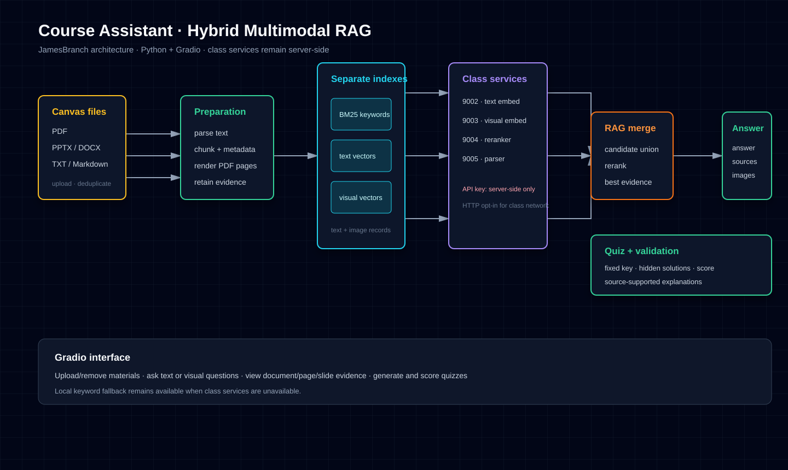
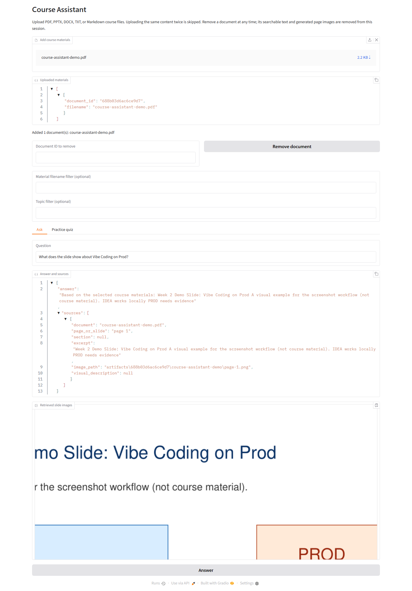
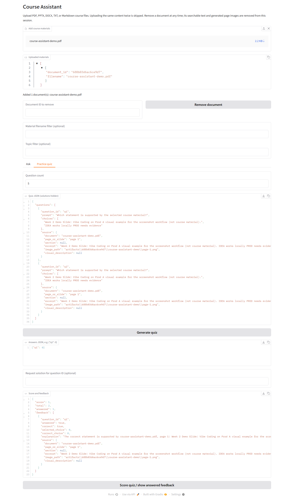

# Course Assistant

A Python course assistant that answers questions and generates practice quizzes from course materials downloaded from Canvas.

## Project goal

Build a grounded, multimodal course assistant that:

- accepts course files such as PDF, PPTX, DOCX, and common text formats;
- preserves extracted text, source locations, and original page/slide images;
- answers questions with hybrid retrieval using keyword, text-embedding, and visual-embedding search;
- acknowledges missing information instead of inventing answers or citations;
- generates fixed-answer multiple-choice quizzes with scores and explanations;
- shows document/page/slide/section references with supporting excerpts or screenshots.

## Collaboration model

This repository is intentionally set up for parallel alternatives:

1. Start from `main`.
2. Create one branch per design, for example `team/<name>-baseline`.
3. Keep changes scoped and include automated checks.
4. Open a pull request describing tradeoffs, test results, and limitations.
5. Compare branches against the same evaluation checklist before selecting a foundation.
6. The selected implementation will be extended on `main` after review.

Do not commit course files, API keys, endpoint credentials, generated indexes, or student data.

## Planned architecture

```text
Canvas files
  -> parser / page-slide renderer
  -> text chunks + source metadata       visual page/slide records
  -> keyword index + text vector index  visual vector index
                  \                    /
                   candidate merge + multimodal reranking
                                |
                 answer or quiz generation with evidence
                                |
                 schema validation + source-support checks
                                |
                         Python interface (planned Gradio)
```

The class service map is documented in [`docs/class-services.md`](docs/class-services.md). The four supplied services use ports 9002–9005; endpoint adapters must follow the model cards and vLLM 0.29.0 conventions. Credentials are intentionally not stored here and must be supplied through server-side environment variables or an ignored local configuration file.

## Local setup

From a fresh clone:

```bash
python -m venv .venv
# Windows: .venv\\Scripts\\activate
# macOS/Linux: source .venv/bin/activate
pip install -r requirements.txt
pip install -e .
pip install -r requirements-optional.txt  # file parsing and Gradio UI
pytest
```

Launch the interface with:

```bash
python -m course_assistant.app
```

Copy `.env.example` to `.env` only for local use, then load it into the server environment before launch. The real class API key must never be placed in source, browser code, logs, screenshots, documentation, test results, or GitHub. The supplied class endpoints use HTTP; set `CLASS_SERVICE_ALLOW_INSECURE_HTTP=true` only on the trusted class network. Use HTTPS for production whenever available.

## Supported input policy

The upload manager accepts PDF, PPTX, DOCX, TXT, and Markdown. PDF files are rendered page-by-page into original page images. PPTX files are accepted directly for text and slide metadata; for reliable original slide-image evidence, export the deck to PDF before upload. Manual export is the supported workaround when LibreOffice is not installed. Optional LibreOffice/`soffice` automation can be added later, but is not required by the current implementation. Unsupported or malformed files receive a clear error without partial searchable content.

In the app, upload files through **Add course materials**. The uploaded-material list shows each content ID. Enter that ID under **Remove document** to remove its chunks and generated artifacts from the active session. Identical file content is skipped on repeat upload.

## Evidence policy

Every answer and quiz explanation must carry structured source records. A source record should identify the document, page/slide or section, a text excerpt or image reference, and enough metadata to reproduce the evidence. If retrieval does not support an answer, the assistant must say that the materials do not establish it.

## Evaluation and status

The project is currently in repository setup. Add benchmark materials only when permitted by the course. Each design comparison should record:

- retrieval configuration and model/service versions;
- latency and failure behavior;
- grounded-answer and citation-support checks;
- quiz answer-key stability;
- visual evidence coverage;
- known limitations and unchecked cases.

Screenshots and findings will be added to `docs/` as the interface becomes available.

## JamesBranch implementation

The first vertical slice is available on `JamesBranch`:

```bash
python -m venv .venv
# Windows: .venv\\Scripts\\activate
pip install -r requirements.txt
pip install -r requirements-optional.txt  # file parsing and Gradio UI
python -m course_assistant.app
```

For a dependency-light question-answering smoke test:

```bash
PYTHONPATH=src python -m course_assistant.cli notes.txt --question "What does the material say?"
```

The implementation provides:

- PDF, PPTX, DOCX, TXT, and Markdown ingestion paths;
- PDF page image preservation and source page/slide metadata;
- separate keyword and visual indexes, optional text/visual embedding indexes, and reranking adapters;
- structured answers with `answer` and `sources` fields;
- missing-information responses when retrieval finds no supporting evidence;
- material/topic filtering and deterministic multiple-choice quizzes with fixed answer keys;
- hidden quiz solutions until the quiz taker answers a question or explicitly requests its solution; answered feedback includes the score, correct/selected choice, explanation, and supporting source;
- Gradio question-answering and quiz/scoring interface.
- Session-scoped upload and removal controls with SHA-256 content deduplication; removing a document rebuilds the searchable corpus and deletes generated artifacts.
- Visual RAG returns retrieved slide images with document and page/slide captions. When the parser service is available, visual sources also receive a conservative description of visible pictures, memes, diagrams, and charts.

The upload manager accepts PDF, PPTX, DOCX, TXT, and Markdown. Unsupported formats are rejected without entering the store, parser failures are reported without leaving partial artifacts, and re-uploading identical bytes is skipped even if the filename changes.

The baseline runs without class credentials using keyword retrieval. When `CLASS_SERVICE_API_KEY` is present in the ignored local environment, the assistant uses the configured class text embedding, visual embedding, and reranking services. Document parsing is wired through the service client for future image-first ingestion.

## Architecture



The SVG matches the implemented flow: upload and deduplicate material, parse text and PDF page images, maintain separate keyword/text/visual indexes, merge and rerank candidates, validate source support, then display answers, sources, slide images, and quizzes.

## Evaluation report

The assignment question set, comparison protocol, saved results, and explicit course-material limitations are in [`docs/evaluation.md`](docs/evaluation.md) and [`docs/evaluation-results.json`](docs/evaluation-results.json). The required “Vibe Coding on Prod” meme case is included as Q6. It remains pending until the permitted Week 2 slides are provided; no fabricated course result is reported. The manual and automated verification checklist is in [`docs/manual-verification.md`](docs/manual-verification.md).

## Screenshots

Screenshots were captured from the running Gradio app using a synthetic, non-course demo PDF so no restricted Canvas content is redistributed. Replace these with permitted course-material captures before submission if the team has approval.

### Answer with retrieved slide



### Quiz feedback with source



## Current findings and limitations

- The live class endpoints were connectivity-tested and their request contracts are documented in `docs/class-services.md`.
- The current answer generator is extractive and conservative; it does not yet call a generative vision-capable LLM because a generation endpoint was not included in the supplied service map.
- PPTX and DOCX preserve text/source locations, but PDF is currently the only parser that renders original page images automatically.
- The quiz generator is a deterministic baseline for evaluating retrieval and evidence behavior, not a final pedagogical question writer.
- Automated tests cover the dependency-light core, security configuration, source validation, answer-key stability, and service request construction. Live service calls are not run in CI.
- Synthetic app screenshots are committed; course-material benchmark results remain pending because permitted Canvas files were not supplied.

## License

TBD by the project team.
