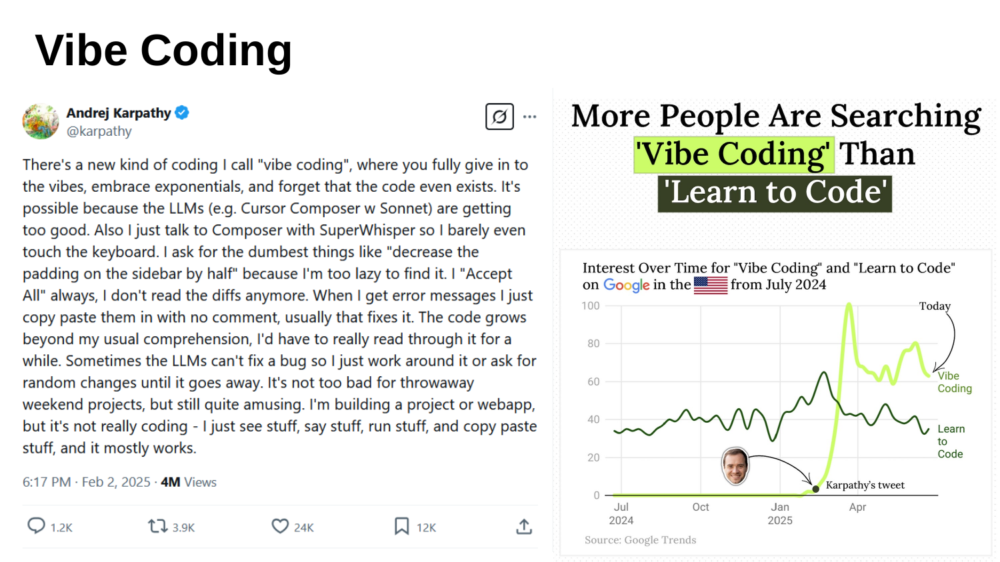
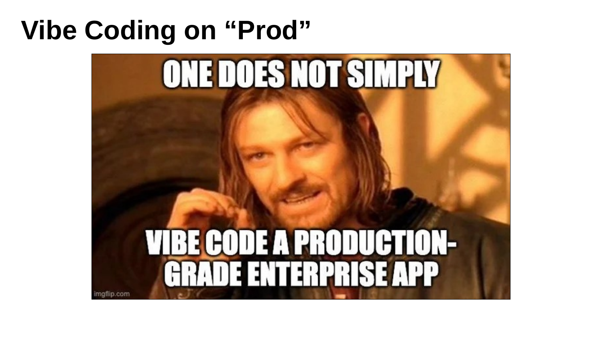
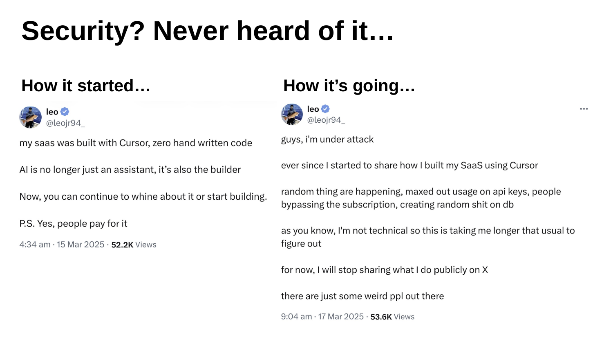

# Course Assistant

A Python course assistant that answers questions and generates practice quizzes from course materials downloaded from Canvas.

## Project goal

Build a grounded, multimodal course assistant that:

- accepts course files such as PDF, PPTX, PPT, ODP, DOCX, and common text formats;
- preserves extracted text, source locations, and original page/slide images;
- answers questions with hybrid retrieval using keyword, text-embedding, and visual-embedding search;
- acknowledges missing information instead of inventing answers or citations;
- generates fixed-answer multiple-choice quizzes with scores and explanations;
- shows document/page/slide/section references with supporting excerpts or screenshots.

## Collaboration model

This repository is intentionally set up for parallel alternatives:

1. Start from `main`.
2. Create one branch per design, for example `team/<name>-baseline`.
3. Keep changes scoped and include automated checks.
4. Open a pull request describing tradeoffs, test results, and limitations.
5. Compare branches against the same evaluation checklist before selecting a foundation.
6. The selected implementation will be extended on `main` after review.

Do not commit course files, API keys, endpoint credentials, generated indexes, or student data.

The final merged implementation is on `main`. PR #7 is merged and its CI checks passed. The repository retains historical branches for team work. The current public audit found no peer-review records for the earlier integration, issues 1–6 remain open, and `main` is not branch-protected; these are collaboration-process limitations, not claims of completed review.


## Architecture at a glance

```text
Canvas files
  -> parser / page-slide renderer
  -> text chunks + source metadata       visual page/slide records
  -> keyword index + text vector index  visual vector index
                  \                    /
                   candidate merge + multimodal reranking
                                |
                 answer or quiz generation with evidence
                                |
                 schema validation + source-support checks
                                |
                                                  Python Gradio interface
```

The class service map is documented in [`docs/class-services.md`](docs/class-services.md). The integrated services use ports 9001–9005: 9001 now provides grounded generative vision answers, while 9002–9005 provide text embeddings, multimodal embeddings, reranking, and document parsing. Credentials are intentionally not stored here and must be supplied through server-side environment variables or an ignored local configuration file.

## Local setup

From a fresh clone:

```bash
python -m venv .venv
# Windows: .venv\\Scripts\\activate
# macOS/Linux: source .venv/bin/activate
pip install -r requirements.txt
pip install -e .
pip install -r requirements-optional.txt  # file parsing and Gradio UI
pytest
```

Launch the interface with:

```bash
python -m course_assistant.app
```

Copy `.env.example` to `.env`, replace only the dummy API key locally, and load the variables into the server process before launch. On macOS/Linux/Git Bash use `set -a; source .env; set +a`. In PowerShell, use `Get-Content .env | Where-Object { $_ -and -not $_.StartsWith('#') } | ForEach-Object { $name,$value = $_ -split '=',2; Set-Item -Path "Env:$name" -Value $value }`. On Render, add the variables under the service's Environment settings and mark `CLASS_SERVICE_API_KEY` as a secret; do not place the value in `render.yaml`. Endpoint names, models, and request formats are listed in [`docs/class-services.md`](docs/class-services.md). The real class API key must never be placed in source, browser code, logs, screenshots, documentation, test results, or GitHub. The supplied class endpoints use HTTP; set `CLASS_SERVICE_ALLOW_INSECURE_HTTP=true` only on the trusted class network. Use HTTPS for production whenever available.

## Supported input policy

The upload manager accepts PDF, PPTX, PPT, ODP, DOCX, TXT, and Markdown. PDF files are rendered page-by-page into original page images. PPTX files are parsed directly and, when LibreOffice/`soffice` is installed, converted to PDF so original slide images are preserved. Legacy PPT and ODP files require LibreOffice for conversion. Without LibreOffice, export slides to PDF before upload. Unsupported or malformed files receive a clear error without partial searchable content.

In the app, upload files through **Add course materials**. The uploaded-material list shows each content ID. Enter that ID under **Remove document** to remove its chunks and generated artifacts from the active session. Identical file content is skipped on repeat upload.

## Use the app

1. Launch with `python -m course_assistant.app` and open the local Gradio URL shown in the terminal, normally `http://127.0.0.1:7860`.
2. In **Add course materials**, upload one or more supported files. The interface reports duplicate uploads and displays each document ID.
3. To remove a document, copy its ID into **Document ID to remove** and select **Remove document**. The document's chunks and generated images are deleted from the active session.
4. In **Ask a question**, optionally filter by material/topic, enter a specific question, and select **Ask Course Assistant**. Read the answer and numbered source excerpts together; visual sources include their original page image. Internally the API retains separate `answer` and `sources` fields.
5. In **Practice quiz**, select a count, choose answers with the on-screen radio buttons, then select **Check answers**. Solutions remain hidden until submission or explicit reveal. With the class vision service configured, the app requests source-anchored conceptual questions; without it, the offline mode derives focused subject–relation questions from explicit source sentences, rejects near-duplicate or same-subject distractors, and refuses when the evidence cannot support a distinct answer. This is a limited rule-based exercise, not a substitute for human-reviewed pedagogy.
6. Rerun the automated checks with `pytest`, or separately with `pytest -m "not e2e" -q` and `pytest -m e2e -q`.

## Deployment

The included `Dockerfile` and `render.yaml` support a Render deployment. The image installs LibreOffice Impress so uploaded presentations can be rendered as slide images. Supply `CLASS_SERVICE_API_KEY` through Render's secret environment settings; never put it in `render.yaml` or the image. Render supplies `PORT`; the app binds to `GRADIO_SERVER_NAME=0.0.0.0`. Configure the endpoint/model variables from `.env.example` when using non-default services. Use HTTPS service URLs in production; set `CLASS_SERVICE_ALLOW_INSECURE_HTTP=true` only for a trusted network using the supplied HTTP endpoints. This repository contains deployment packaging, not a completed hosted deployment; a public deployment URL must be recorded only after a real smoke test.

## Evidence policy

Every answer and quiz explanation must carry structured source records. A source record should identify the document, page/slide or section, a text excerpt or image reference, and enough metadata to reproduce the evidence. If retrieval does not support an answer, the assistant must say that the materials do not establish it.

## Evaluation and status

The current merged behavior hides quiz source excerpts until answer/reveal, abstains when a text-only query has insufficient evidence overlap, and defaults insecure HTTP access to disabled. These behaviors are covered by regression tests in the final branch.


The implemented baseline is tested locally and documented in `docs/evaluation.md`. The supplied decks were evaluated with ten repeatable questions using the keyword baseline and offline hybrid fallback; aggregate results and returned slide locations are in `docs/evaluation-results.json`. That JSON is the original benchmark record and retains the historical pre-remediation Q10 failure; the current merged code includes the abstention fix and regression test, but the permitted-deck benchmark must be rerun before claiming post-fix quality results. A live comparison with class embeddings/reranking and original-slide visual recall remains pending until authorized course materials, credentials, and the optional rendering stack are available.

**Update, October 5, 2026.** That live run has now been done. The class-service adapters were corrected so the app works with ports 9001 to 9005 turned on, and seven questions were run against the Week 2 to Week 5 decks and the course syllabus with the class embeddings, with reranking on and off, and with LibreOffice slide rendering. The questions, answers, and comparison are in the [Questions](#questions) section at the bottom of this README. The earlier keyword and offline-fallback record in `docs/evaluation.md` is kept as history.

## Integrated implementation

The integrated app combines JamesBranch's verified material management, hybrid retrieval, visual evidence, structured answers, quiz controls, service fallbacks, security checks, and automated tests with EliasBranch's LibreOffice presentation rendering, upload-size guard, deployment packaging, and responsive port configuration.

For a dependency-light question-answering smoke test:

```bash
PYTHONPATH=src python -m course_assistant.cli notes.txt --question "What does the material say?"
```

The implementation provides:

- PDF, PPTX, PPT, ODP, DOCX, TXT, and Markdown ingestion paths;
- PDF page and optional LibreOffice-rendered presentation image preservation with source page/slide metadata;
- separate keyword, local text-embedding, and visual-embedding indexes, with optional class-service embeddings and multimodal reranking;
- structured answers with `answer` and `sources` fields;
- missing-information responses when retrieval finds no supporting evidence;
- material/topic filtering and deterministic multiple-choice quizzes with fixed answer keys;
- hidden quiz solutions until the quiz taker answers a question or explicitly requests its solution; answered feedback includes the score, correct/selected choice, explanation, and supporting source;
- Gradio question-answering and quiz/scoring interface.
- Session-scoped upload and removal controls with SHA-256 content deduplication; removing a document rebuilds the searchable corpus and deletes generated artifacts.
- Visual RAG returns retrieved slide images with document and page/slide captions. When the parser service is available, visual sources also receive a conservative description of visible pictures, memes, diagrams, and charts.

The upload manager accepts PDF, PPTX, PPT, ODP, DOCX, TXT, and Markdown. Unsupported formats are rejected without entering the store, parser failures are reported without leaving partial artifacts, and re-uploading identical bytes is skipped even if the filename changes. Uploads are capped at 150 MB.

The baseline runs without class credentials using keyword retrieval plus deterministic hashed token/ngram indexes (these are **not semantic embeddings**). When `CLASS_SERVICE_API_KEY` is present in the ignored local environment and HTTP is explicitly permitted on a trusted network, the assistant can use 9001 for grounded multimodal answers and conceptual quiz drafting, 9002 for text embeddings, 9003 for visual embeddings, 9004 for multimodal reranking, and 9005 for visual parsing. Search rejects zero/negative vector matches, source IDs in model answers must be in range, and unsupported numerical claims fall back to extractive evidence. The offline path cannot explain a scanned image with no extracted text; it abstains instead. See [`docs/evidence-first-evaluation.md`](docs/evidence-first-evaluation.md) for measured checks and remaining quality gaps.

## Architecture diagram


The SVG matches the implemented flow: upload and deduplicate material, parse text and PDF page images, maintain separate keyword/text/visual indexes, merge and rerank candidates, validate source support, then display answers, sources, slide images, and quizzes.

## Evaluation report

The assignment question set, comparison protocol, saved results, and investigated limitations are in [`docs/evaluation.md`](docs/evaluation.md) and [`docs/evaluation-results.json`](docs/evaluation-results.json). The ten-question run includes two visual cases, including the required Week 2 “Vibe Coding on Prod” case. That run lacked LibreOffice and the class visual services, so its visual image checks were left pending; the live run in the [Questions](#questions) section completes them. The manual and automated verification checklist is in [`docs/manual-verification.md`](docs/manual-verification.md).

## Screenshots

These screenshots were captured on October 5, 2026 from the running app with the class services turned on, the Week 2 to Week 5 decks uploaded as PowerPoint files, and the syllabus uploaded as a PDF. The first shows an answer with the retrieved slide image for the Week 2 meme question. The second shows practice quiz feedback with the score, the correct choices, and the source for each question.

### Answer with retrieved slide


### Quiz feedback with source


### Visual evidence examples from Week 2

The following permitted course-material screenshots are three representative targets for visual retrieval. They cover a quantitative trend, a meme, and a before-and-after security example. The assistant should return the original image together with the deck name and slide number when a matching question is asked.

#### Vibe Coding search trend · slide 29

The chart compares Google search interest for “Vibe Coding” and “Learn to Code” following Andrej Karpathy's February 2025 post.



#### Vibe Coding on production systems · slide 33

The meme warns that casually generated code should not be treated as a production-grade enterprise application without engineering review.



#### Security consequences · slide 34

The paired posts contrast the launch of a no-handwritten-code SaaS with later reports of API-key abuse, subscription bypasses, and unauthorized database activity.



## Current findings and limitations

- The integrated answer path can now use the class vision-capable Qwen3.6 service for grounded text-and-image synthesis, while retaining a tested local fallback when the service is unavailable.
- The retrieval stack is ready for stronger semantic and multimodal recall through Nemotron text embeddings, Qwen3-VL embeddings, and Qwen3-VL reranking; the dependency-light keyword path remains available for offline use.
- LibreOffice remains the preferred path for complete PPT/PPTX/ODP slide rendering. When it is unavailable, PPTX ingestion preserves the largest original embedded picture on each slide so memes, screenshots, charts, and other raster evidence remain available for retrieval. Shape-only diagrams still require full rendering or PDF export.
- The quiz generator is a deterministic baseline for evaluating retrieval and evidence behavior, with stable keys and source-backed feedback; a richer pedagogical writer can be added without changing the evidence contract.
- Automated tests cover the dependency-light core, security configuration, source validation, answer-key stability, and service request construction. Live service calls are not run in CI.
- The class-service request and response formats were corrected on October 5, 2026 after a live run showed the app crashing on the text-embedding reply and the visual-embedding and reranking requests being rejected. The working formats are recorded in `docs/class-services.md` and locked in by `tests/test_class_service_contracts.py`. Slide descriptions now come from the 9001 vision model, with the 9005 parser as a fallback, and embeddings are cached so each slide is sent to the services once per session. The app also now honors the answer model's explicit "could not find" reply. Before that fix, a question about the Quiz 1 class average was answered by reading the syllabus schedule aloud, because the schedule mentions Quiz 1.

## License

TBD by the project team.

## Questions

We wrote seven questions to test the assistant on the Week 2 to Week 5 lecture decks and the course syllabus. Two can be answered from slide text, two from the syllabus, two need the picture on the slide, and one cannot be answered from the materials at all. For each one we give the answer the materials support and then say what our app actually returned.

The app results come from the code on `main` on October 5, 2026, with the four decks uploaded as PowerPoint files, the syllabus uploaded as a PDF, and the class services turned on: the vision model, text embeddings, visual embeddings, the reranker, and LibreOffice slide rendering. In this setup an answer has two parts. The first part is text from the slide or page read back with numbered sources. The second part is a short description of the top slide or page written by the class vision model, which the app labels as model-generated and shows next to the original image.

### Questions answered from slide text

**1. What do the Week 4 slides recommend about branching, issues, and pull requests when collaborating on GitHub?**

Use a branch to keep a new feature, a bug fix, or an experiment separate from main, which holds the primary version of the project. When the work is ready, merge it back in. Create issues to keep a record of tasks, discussions, and progress. Open a pull request to propose changes you want merged, so collaborators can review, discuss, and suggest revisions first. (Week 4, slides 25 and 26)

*What the app returned:* Both slides, 26 and 25, with their images. The answer covered issues, pull requests, branching, and merging.

**2. Which chunking strategies are listed for preparing documents for a RAG system?**

There are four. Fixed size chunking uses a set length, often with overlap. Recursive chunking splits at larger boundaries like paragraphs and then breaks oversized pieces at smaller boundaries like sentences. Document-based chunking keeps related content together using structure such as headings. Semantic chunking splits where the topic or meaning changes. (Week 5, slide 17)

*What the app returned:* Slide 16 on preparing documents first, then slide 17 with the four strategies. All four appear in the answer, after the material from slide 16.

### Questions answered from the syllabus

**3. How is the final course grade broken down according to the syllabus?**

Assignments are 20 percent, quizzes 15 percent, the final project 45 percent, the final exam 15 percent, and attendance and participation 5 percent. (Syllabus, page 2)

*What the app returned:* Page 2 of the syllabus with the grading table read back. All five percentages are in the answer.

**4. What is the penalty for turning in an assignment late?**

The grade drops 10 percent for every calendar day the assignment is late. Nothing is accepted more than five days late. The assignment with the lowest score is dropped from the final grade. (Syllabus, pages 2 and 3)

*What the app returned:* Pages 2 and 3 of the syllabus. The answer included the 10 percent per day penalty with the worked example, the five day limit, and the dropped lowest score.

### Questions that need the image on the slide

**5. What's the meme about vibe coding on "Prod" in week 2's course slides? Explain what the image and text show.**

It is the "One does not simply" meme with Boromir from The Lord of the Rings, captioned to say that one does not simply vibe code a production-grade enterprise app. The point is that vibe coding is fine for quick prototypes, but shipping to production takes real engineering and review. (Week 2, slide 33)

*What the app returned:* The right slide and the original meme image. The slide description named the Boromir meme, read the caption off the picture word for word, and explained the joke. The slide has no body text, so everything useful here came from the image.

**6. What does the "Lost in the Middle" chart on the context engineering slides show about accuracy versus the position of the document containing the answer?**

The chart is a U-shaped curve. Accuracy is highest when the document with the answer comes first, drops as that document moves toward the middle of the context, and rises again near the end. The slide adds that some newer models resist this effect better, but results still depend on the model and the task. (Week 5, slide 7)

*What the app returned:* The right slide and its image. The slide description gave the axes and described the U shape, with high accuracy at the start, low in the middle, and a rise at the end.

### The question the materials cannot answer

**7. What was the class average on Quiz 1?**

*What the app returned:* "I could not find that information in the selected course materials." It cited no sources, which is exactly what we want.

This cannot be answered because no document we uploaded reports quiz results. The syllabus says quizzes are worth 15 percent of the grade and its schedule lists Quiz 1 in Week 6, but it says nothing about how the class did. Scores like that would come from Canvas or an announcement, not from slides or a syllabus.

This question also exposed a real failure that we investigated. The first time we ran it, the app did not refuse. Because the schedule mentions "Quiz 1", the search matched that page and the app read the whole schedule back as if it were an answer. When we looked closer, the class answer model had correctly replied that it could not find the information, but the app discarded that reply because it contained no citations and fell back to reading the page aloud. We changed the app to honor the model's "could not find" reply, added a test for it, and reran the question. It now refuses, with reranking on and off.

### Comparing two approaches: reranking on and off

We ran the same seven questions on the same five files twice. The only difference was whether the class reranker on port 9004 reordered the retrieved slides and pages. Everything else stayed the same: keyword search, class text embeddings, class visual embeddings, and the vision model. We judged correctness by hand against the answers above. Times are single runs measured from asking to receiving the answer, after the files were indexed, and they move around with how busy the class servers are.

| | Reranking on | Reranking off |
|---|---|---|
| Fully correct | 7 of 7 | 6 of 7 |
| Partly correct | 0 | 1 (question 1) |
| Expected slide or page returned | 6 of 6 answerable questions | 6 of 6 answerable questions |
| Sources support the answer | Yes for all six | Yes for five; question 1 is missing the branching slide |
| Unanswerable question refused | Yes | Yes |
| Median time per question | 13.9 seconds | 7.6 seconds |

| Question | Reranking on: sources returned, seconds | Reranking off: sources returned, seconds |
|---|---|---|
| 1 | Week 4 slide 26, Week 4 slide 25, 16.6 | Week 4 slide 26, Week 4 slide 21, 6.7 |
| 2 | Week 5 slide 16, Week 5 slide 17, 13.5 | Week 5 slide 16, Week 5 slide 17, 9.2 |
| 3 | Syllabus page 2, 13.9 | Syllabus page 3, Syllabus page 2, 7.6 |
| 4 | Syllabus page 2, Syllabus page 3, 7.0 | Syllabus page 2, Syllabus page 3, 2.4 |
| 5 | Week 2 slide 33, Week 2 slide 30, 11.2 | Week 2 slide 33, Week 2 slide 2, 8.7 |
| 6 | Week 5 slide 7, Week 5 slide 3, 15.8 | Week 5 slide 7, Week 5 slide 19, 9.3 |
| 7 | none, 15.6 | none, 4.4 |

Reranking did not change whether the main slide or page was found. Combining the keyword, text, and visual searches was already enough for that. What reranking changed was the supporting source and the order. In question 1 it brought in the branching slide, which turned a partial answer into a complete one; without it the app returned a slide about letting a coding agent run GitHub commands, which does not cover branching. In question 3 it put the grading table first, where without it the answer opened with late policy text and only then gave the grade breakdown. The cost was about 6 extra seconds per question in this run.

We would keep reranking on. A study tool that returns the second slide a student needs, in a sensible order, is worth the wait, and the reranker is the only step that judges each slide image against the question. If speed mattered more, for example with many students using the app at once, turning it off would still find the right main source.

### What these seven questions tell us

With the class services on, the assistant found the right slide or page and showed the original image for all six answerable questions, and it refused the one question it had no evidence for. Three limits are worth knowing.

First, the text part of every answer was material read back from the source, not a rewritten explanation, so answers to broad questions can run long. The class answer model does write clear, cited answers, but the app only accepts wording that closely matches the source and otherwise falls back to reading the source back.

Second, the picture description is written once per slide and is not tailored to the question. In an earlier test outside this set, a question about one row of a table that was pasted in as an image returned the right slide but left that row out of the description. For details like that, a student should read the slide image the app returns.

Third, refusing unanswerable questions depends on the class answer model being reachable. Without it the app falls back to keyword rules, and those rules are what let the Quiz 1 question through before the fix.

## Bugs found during testing

These came up while running the app on `main` against the real course decks and the syllabus with the class services turned on. All of them are fixed on `main` unless the status says otherwise.

| # | Bug | What it caused | Status |
|---|---|---|---|
| 1 | The text embedding adapter (port 9002) read the reply as a list, but the service nests the vectors under `embeddings.float`. | Every question crashed as soon as the class services were enabled. With the default settings the app silently fell back to offline search instead, which hid the problem. | Fixed |
| 2 | The visual embedding adapter (port 9003) sent a list of image objects in one request, which the service rejects. | Visual embeddings never ran, so slide images were not searchable by meaning. | Fixed: one image per request |
| 3 | The reranker adapter (port 9004) sent documents in a format the service rejects, and read scores in reply order instead of by the returned index. | Reranking never ran; once the format was fixed, scores could have been matched to the wrong slides. | Fixed |
| 4 | The "thinking off" setting for the answer model (port 9001) was sent inside an `extra_body` field, which is an SDK option the server ignores. | The model could spend its token budget on hidden reasoning and return a cut-off or empty answer. | Fixed: sent at the top level |
| 5 | Slide descriptions were requested from the document parser (port 9005), which is an OCR model. | Long, rambling descriptions with mistakes, for example miscategorized company logos and leftover formatting markup. | Fixed: descriptions now come from the 9001 vision model, parser kept as fallback |
| 6 | The app rebuilt its search index and re-embedded every slide for each question. | With the class services on, each question took an extra 30 seconds or more of indexing. | Fixed: embeddings and descriptions cached per slide |
| 7 | When the answer model replied that it could not find the information, the app discarded the reply because it had no citations and read a loosely matching page back instead. | "What was the class average on Quiz 1?" was answered with the syllabus schedule because it mentions Quiz 1. | Fixed: the refusal is honored, with a regression test |
| 8 | The repository's automated checks on GitHub were failing at test collection because a test imports Pillow and python-pptx, which were not installed. | Every push showed a red check, and no tests ran on GitHub. | Fixed: both added to `requirements.txt` |
| 9 | The app only accepts a model-written answer when its wording closely matches the source text. | The answer model writes clear, cited answers, but the app discards them and shows the source text read back instead, so answers can be long and hard to read. | Not changed: this is the evidence-first design choice, noted as a limitation |
| 10 | The picture description is written once per slide and is not tailored to the question. | A question about one row of a table pasted in as an image returned the right slide but left that row out of the description. | Not changed: the slide image is shown so the student can read it |

Earlier, before the class services were fixed, the app in its offline mode also returned the wrong slide for the chunking strategies question and could not describe the meme or the chart at all. Both of those went away once the services were working.
