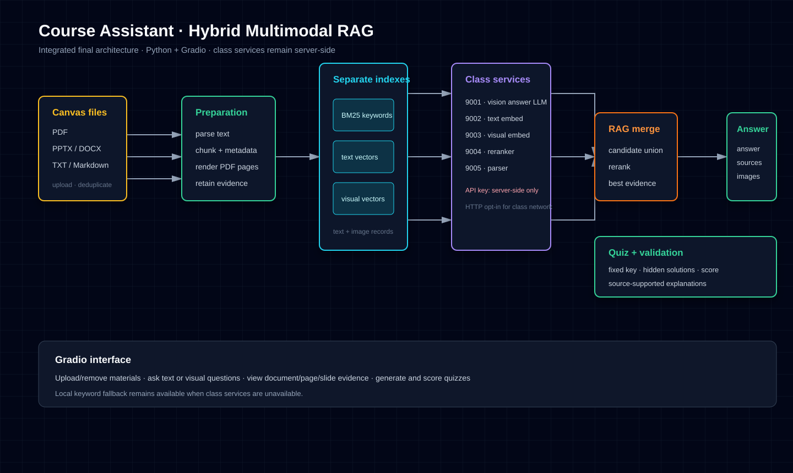
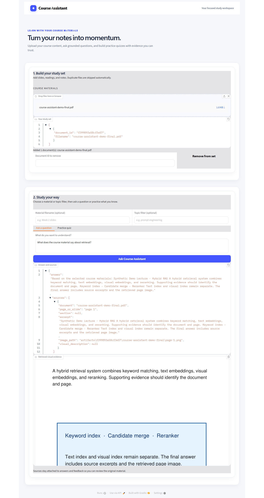
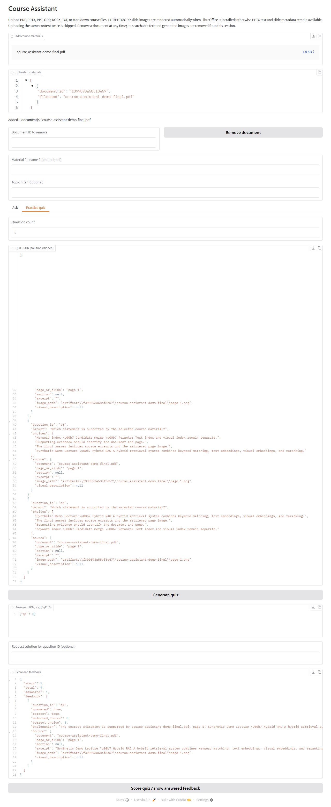

# Course Assistant

A Python course assistant that answers questions and generates practice quizzes from course materials downloaded from Canvas.

## Project goal

Build a grounded, multimodal course assistant that:

- accepts course files such as PDF, PPTX, PPT, ODP, DOCX, and common text formats;
- preserves extracted text, source locations, and original page/slide images;
- answers questions with hybrid retrieval using keyword, text-embedding, and visual-embedding search;
- acknowledges missing information instead of inventing answers or citations;
- generates fixed-answer multiple-choice quizzes with scores and explanations;
- shows document/page/slide/section references with supporting excerpts or screenshots.

## Collaboration model

This repository is intentionally set up for parallel alternatives:

1. Start from `main`.
2. Create one branch per design, for example `team/<name>-baseline`.
3. Keep changes scoped and include automated checks.
4. Open a pull request describing tradeoffs, test results, and limitations.
5. Compare branches against the same evaluation checklist before selecting a foundation.
6. The selected implementation will be extended on `main` after review.

Do not commit course files, API keys, endpoint credentials, generated indexes, or student data.

## Architecture at a glance

```text
Canvas files
  -> parser / page-slide renderer
  -> text chunks + source metadata       visual page/slide records
  -> keyword index + text vector index  visual vector index
                  \                    /
                   candidate merge + multimodal reranking
                                |
                 answer or quiz generation with evidence
                                |
                 schema validation + source-support checks
                                |
                                                  Python Gradio interface
```

The class service map is documented in [`docs/class-services.md`](docs/class-services.md). The four supplied services use ports 9002–9005; endpoint adapters must follow the model cards and vLLM 0.29.0 conventions. Credentials are intentionally not stored here and must be supplied through server-side environment variables or an ignored local configuration file.

## Local setup

From a fresh clone:

```bash
python -m venv .venv
# Windows: .venv\\Scripts\\activate
# macOS/Linux: source .venv/bin/activate
pip install -r requirements.txt
pip install -e .
pip install -r requirements-optional.txt  # file parsing and Gradio UI
pytest
```

Launch the interface with:

```bash
python -m course_assistant.app
```

Copy `.env.example` to `.env`, replace only the dummy API key locally, and load the variables into the server process before launch. On macOS/Linux/Git Bash use `set -a; source .env; set +a`. In PowerShell, use `Get-Content .env | Where-Object { $_ -and -not $_.StartsWith('#') } | ForEach-Object { $name,$value = $_ -split '=',2; Set-Item -Path "Env:$name" -Value $value }`. On Render, add the variables under the service's Environment settings and mark `CLASS_SERVICE_API_KEY` as a secret; do not place the value in `render.yaml`. Endpoint names, models, and request formats are listed in [`docs/class-services.md`](docs/class-services.md). The real class API key must never be placed in source, browser code, logs, screenshots, documentation, test results, or GitHub. The supplied class endpoints use HTTP; set `CLASS_SERVICE_ALLOW_INSECURE_HTTP=true` only on the trusted class network. Use HTTPS for production whenever available.

## Supported input policy

The upload manager accepts PDF, PPTX, PPT, ODP, DOCX, TXT, and Markdown. PDF files are rendered page-by-page into original page images. PPTX files are parsed directly and, when LibreOffice/`soffice` is installed, converted to PDF so original slide images are preserved. Legacy PPT and ODP files require LibreOffice for conversion. Without LibreOffice, export slides to PDF before upload. Unsupported or malformed files receive a clear error without partial searchable content.

In the app, upload files through **Add course materials**. The uploaded-material list shows each content ID. Enter that ID under **Remove document** to remove its chunks and generated artifacts from the active session. Identical file content is skipped on repeat upload.

## Use the app

1. Launch with `python -m course_assistant.app` and open the local Gradio URL shown in the terminal, normally `http://127.0.0.1:7860`.
2. In **Add course materials**, upload one or more supported files. The interface reports duplicate uploads and displays each document ID.
3. To remove a document, copy its ID into **Document ID to remove** and select **Remove document**. The document's chunks and generated images are deleted from the active session.
4. In **Ask**, optionally enter a material filename and topic filter, enter a question, and select **Answer**. Review the separate `answer` and `sources` fields, excerpts, document/page or slide locations, and retrieved slide images.
5. In **Practice quiz**, choose a question count and optional filters, select **Generate quiz**, and keep the returned answer key private. Submit a JSON answer map such as `{"q1": 0}` or request one question's solution; feedback includes the score, explanation, and supporting sources.
6. Rerun the automated checks with `pytest`, or separately with `pytest -m "not e2e" -q` and `pytest -m e2e -q`.

## Deployment

The included `Dockerfile` and `render.yaml` support a Render deployment. The image installs LibreOffice Impress so uploaded presentations can be rendered as slide images. Supply `CLASS_SERVICE_API_KEY` through Render's secret environment settings; never put it in `render.yaml` or the image. The supplied class URLs are HTTP, so production deployments intentionally fall back to the local keyword baseline unless HTTPS service URLs and `CLASS_SERVICE_ALLOW_INSECURE_HTTP=true` are explicitly configured on a trusted network.

## Evidence policy

Every answer and quiz explanation must carry structured source records. A source record should identify the document, page/slide or section, a text excerpt or image reference, and enough metadata to reproduce the evidence. If retrieval does not support an answer, the assistant must say that the materials do not establish it.

## Evaluation and status

The implemented baseline is tested locally and documented in `docs/evaluation.md`. The supplied decks were evaluated with ten repeatable questions using the keyword baseline and offline hybrid fallback; aggregate results and returned slide locations are in `docs/evaluation-results.json`. A live comparison with class embeddings/reranking remains pending until credentials and LibreOffice are available.

## Integrated implementation

The integrated app combines JamesBranch's verified material management, hybrid retrieval, visual evidence, structured answers, quiz controls, service fallbacks, security checks, and automated tests with EliasBranch's LibreOffice presentation rendering, upload-size guard, deployment packaging, and responsive port configuration.

```bash
python -m venv .venv
# Windows: .venv\\Scripts\\activate
pip install -r requirements.txt
pip install -e .
pip install -r requirements-optional.txt  # file parsing and Gradio UI
python -m course_assistant.app
```

For a dependency-light question-answering smoke test:

```bash
PYTHONPATH=src python -m course_assistant.cli notes.txt --question "What does the material say?"
```

The implementation provides:

- PDF, PPTX, PPT, ODP, DOCX, TXT, and Markdown ingestion paths;
- PDF page and optional LibreOffice-rendered presentation image preservation with source page/slide metadata;
- separate keyword and visual indexes, optional text/visual embedding indexes, and reranking adapters;
- structured answers with `answer` and `sources` fields;
- missing-information responses when retrieval finds no supporting evidence;
- material/topic filtering and deterministic multiple-choice quizzes with fixed answer keys;
- hidden quiz solutions until the quiz taker answers a question or explicitly requests its solution; answered feedback includes the score, correct/selected choice, explanation, and supporting source;
- Gradio question-answering and quiz/scoring interface.
- Session-scoped upload and removal controls with SHA-256 content deduplication; removing a document rebuilds the searchable corpus and deletes generated artifacts.
- Visual RAG returns retrieved slide images with document and page/slide captions. When the parser service is available, visual sources also receive a conservative description of visible pictures, memes, diagrams, and charts.

The upload manager accepts PDF, PPTX, PPT, ODP, DOCX, TXT, and Markdown. Unsupported formats are rejected without entering the store, parser failures are reported without leaving partial artifacts, and re-uploading identical bytes is skipped even if the filename changes. Uploads are capped at 150 MB.

The baseline runs without class credentials using keyword retrieval. When `CLASS_SERVICE_API_KEY` is present in the ignored local environment, the assistant uses the configured class text embedding, visual embedding, and reranking services. Document parsing is wired through the service client for future image-first ingestion.

## Architecture diagram



The SVG matches the implemented flow: upload and deduplicate material, parse text and PDF page images, maintain separate keyword/text/visual indexes, merge and rerank candidates, validate source support, then display answers, sources, slide images, and quizzes.

## Evaluation report

The assignment question set, comparison protocol, saved results, and investigated limitations are in [`docs/evaluation.md`](docs/evaluation.md) and [`docs/evaluation-results.json`](docs/evaluation-results.json). The ten-question run includes two visual cases, including the required Week 2 “Vibe Coding on Prod” case. Its visual image checks remain pending because this local run lacked LibreOffice and class visual services. The manual and automated verification checklist is in [`docs/manual-verification.md`](docs/manual-verification.md).

## Screenshots

Screenshots were captured from the running Gradio app using a synthetic, non-course demo PDF so no restricted Canvas content is redistributed. Replace these with permitted course-material captures before submission if the team has approval.

### Answer with retrieved slide



### Quiz feedback with source



## Current findings and limitations

- The live class endpoints were connectivity-tested and their request contracts are documented in `docs/class-services.md`.
- The current answer generator is extractive and conservative; it does not yet call a generative vision-capable LLM because a generation endpoint was not included in the supplied service map.
- PPT/PPTX/ODP image rendering depends on LibreOffice; without it, PPTX text and source locations still work and manual PDF export is supported.
- The quiz generator is a deterministic baseline for evaluating retrieval and evidence behavior, not a final pedagogical question writer.
- Automated tests cover the dependency-light core, security configuration, source validation, answer-key stability, and service request construction. Live service calls are not run in CI.
- Synthetic app screenshots are committed; course-material benchmark results remain pending because permitted Canvas files were not supplied.

## License

TBD by the project team.
